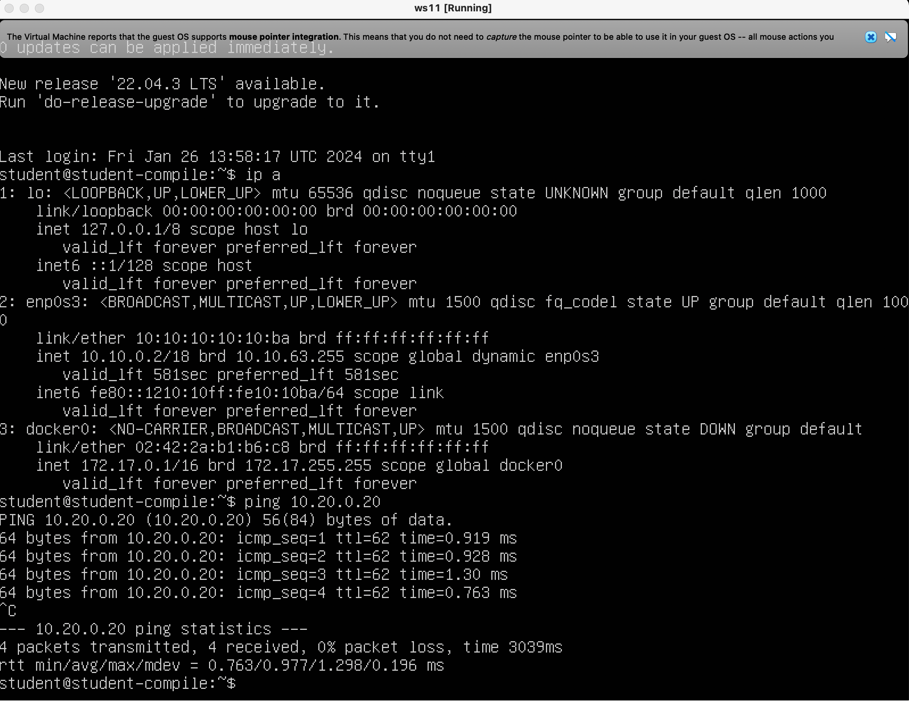
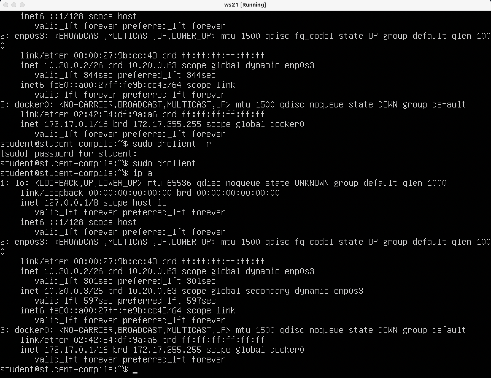

# Linux-Network
Linux networks configuration on virtual machines.
#####################################################

## 1.1. Сети и маски
- 1) Адрес сети *192.167.38.54/13*
    - 192.160.0.0
- 2) Перевод маски *255.255.255.0* в префиксную и двоичную запись, */15* в обычную и двоичную, *11111111.11111111.11111111.11110000* в обычную и префиксную
    - 255.255.255.0 = 11111111.11111111.11111111.00000000 = /24
    - /15 = 11111111.11111110.00000000.00000000 = 255.254.0.0
    - 11111111.11111111.11111111.11110000 = /28 = 255.255.255.240
- 3) Минимальный и максимальный хост в сети *12.167.38.4* при масках: */8*, *11111111.11111111.00000000.00000000*, *255.255.254.0* и */4*
    - 
    Ввывод команды ipcalc для указанных масок сети 12.167.38.4. В выводе видны минимальный и максиальный хост
    - 

## 1.2. localhost
- 194.34.23.100: Этот IP-адрес не является частью диапазона локальных адресов, который обычно используется для localhost (127.0.0.0/8). Таким образом, обращение к localhost по этому адресу не будет успешным.

- 127.0.0.2: Этот IP-адрес является допустимым для обращения к localhost, так как он принадлежит диапазону локальных адресов (127.0.0.0/8). Обращение к приложению, работающему на localhost, с использованием этого адреса, должно быть успешным.

- 127.1.0.1: Также, как и предыдущий адрес (127.0.0.2), этот IP-адрес принадлежит диапазону локальных адресов, и обращение к приложению на localhost должно быть успешным.

- 128.0.0.1: Этот IP-адрес не является допустимым для обращения к localhost, так как он не принадлежит диапазону локальных адресов.

## 1.3. Диапазоны и сегменты сетей
- 1) Какие из перечисленных IP можно использовать в качестве публичного, а какие только в качестве частных:
    - *10.0.0.45* - частный,
    - *134.43.0.2* - публичный,
    - *192.168.4.2* - частный,
    - *172.20.250.4* - частный,
    - *172.0.2.1* - публичный(некорректный), 
    - *192.172.0.1* - публичный,
    - *172.68.0.2* - публичный(некооректный),
    - *172.16.255.255* - частный,
    - *10.10.10.10* - частный,
    - *192.169.168.1* - публичный
- 2) Какие из перечисленных IP адресов шлюза возможны у сети *10.10.0.0/18*: *10.0.0.1*, *10.10.0.2*, *10.10.10.10*, *10.10.100.1*, *10.10.1.255*
    - 10.10.0.2, 10.10.10.10 и 10.10.1.255

## Part 2. Статическая маршрутизация между двумя машинами

- Подними две виртуальные машины (далее -- ws1 и ws2).

- С помощью команды `ip a` посмотри существующие сетевые интерфейсы.
- 
- Опиши сетевой интерфейс, соответствующий внутренней сети, на обеих машинах и задать следующие адреса и маски: ws1 - *192.168.100.10*, маска */16*, ws2 - *172.24.116.8*, маска */12*.
- Cкрины с содержанием изменённого файла *etc/netplan/00-installer-config.yaml* для каждой машины:
- 
- Выполни команду `netplan apply` для перезапуска сервиса сети.
- Cкрин с вызовом и выводом использованной команды:
- 

## 2.1. Добавление статического маршрута вручную
- Добавь статический маршрут от одной машины до другой и обратно при помощи команды вида `ip r add`.
- Пропингуй соединение между машинами.
- Cкрин с вызовом и выводом использованных команд:
- 

## 2.2. Добавление статического маршрута с сохранением
- Перезапусти машины.
- Добавь статический маршрут от одной машины до другой с помощью файла *etc/netplan/00-installer-config.yaml*.
- Скрин с содержанием изменённого файла *etc/netplan/00-installer-config.yaml*.
- 
- В отчёт помести скрин с вызовом и выводом использованной команды.
- 


## Part 3. Утилита **iperf3**

- 3.1. Скорость соединения
    - 8 Mbps = 8/8 MB/s = 1 MB/s
    - 100 MB/s = 100*1000*8 = 800000 Kbps
    - 1 Gbps = 1*1000 Mbps = 1000 Mbps

- 3.2. Утилита **iperf3**
    - Измерь скорость соединения между ws1 и ws2.
    - 
    

## Part 4. Сетевой экран

## 4.1. Утилита **iptables**
- Создай файл */etc/firewall.sh*, имитирующий фаерволл, на ws1 и ws2:

- Скрин с содержанием файла */etc/firewall* для каждой машины.
- 

- Запусти файлы на обеих машинах командами `chmod +x /etc/firewall.sh` и `/etc/firewall.sh`.
- В отчёте опиши разницу между стратегиями, применёнными в первом и втором файлах.
-```iptables -F```- очистка всех правил.\
-```iptables -X```- удаление цепочки.\
-```-A INPUT```- добавление правило для входящих пакетов\
-``` -p tcp```- указывает протокол  tcp\
-```--dportT```- указание порта назначения пакета UDP\
-```-j ACCEPT```- разрешение прохождения пакета дальше по чепочке правил, если правило подошло.\
-```--icmp-type echo-reply```- указание типа сводки ICMP.(получение ответа на ping)\

## 4.2. Утилита **nmap**
- Командой **ping** найди машину, которая не «пингуется», после чего утилитой **nmap** покажи, что хост машины запущен.
*Проверка: в выводе nmap должно быть сказано: `Host is up`*.
- Скрины с вызовом и выводом использованных команд **ping** и **nmap**.
- 


## Part 5. Статическая маршрутизация сети

- Подними пять виртуальных машин (3 рабочие станции (ws11, ws21, ws22) и 2 роутера (r1, r2)).

## 5.1. Настройка адресов машин
- Настрой конфигурации машин в *etc/netplan/00-installer-config.yaml* согласно сети на рисунке.
    - Cкрины с содержанием файла *etc/netplan/00-installer-config.yaml* для каждой машины.
    - ws11,ws22
    - 
    - ws 21
    - 
    - r1,r2
    - 
- Перезапусти сервис сети. Если ошибок нет, то командой `ip -4 a` проверь, что адрес машины задан верно. Также пропингуй ws22 с ws21. Аналогично пропингуй r1 с ws11.
    - ws11,ws22 ip -4 a:
    - 
    - ws21 ip -4 a:
    - 
    - r1, r2 ip -4 a:
    - 
    - Пинг ws22 с ws21:
    - 
    - Пинг r1 с ws11:
    - 

## 5.2. Включение переадресации IP-адресов
- Для включения переадресации IP, выполни команду на роутерах:
`sysctl -w net.ipv4.ip_forward=1`
    - Cкрин с вызовом и выводом использованной команды.
    - 

- Открой файл */etc/sysctl.conf* и добавь в него следующую строку: `net.ipv4.ip_forward = 1`
- Cкрин с содержанием изменённого файла */etc/sysctl.conf*.
    - 

## 5.3. Установка маршрута по-умолчанию

- Вызов `ip r` и покажи, что добавился маршрут в таблицу маршрутизации.
    - ip r wq11+ws22
    - 
    - ip r ws21
    - 
    - ip r r1+r2
    - 
- Пропингуй с ws11 роутер r2 и покажи на r2, что пинг доходит. Для этого используй команду: `tcpdump -tn -i eth0`
- 

## 5.4. Добавление статических маршрутов
- Добавил в роутеры r1 и r2 статические маршруты в файле конфигураций.
- 

- Вызов `ip r` и таблицы с маршрутами на обоих роутерах.
- 

- Запуск команды на ws11:
`ip r list 10.10.0.0/[маска сети]` и `ip r list 0.0.0.0/0`
- 

- Путь к 10.10.0.0/18 осуществляется через 10.10.0.2. Путь к 0.0.0.0/0 был проложен шлюз по умолчанию 10.10.0.1. Это происходит по причине того, что щлюз хоста ws11 с IP адресом 10.10.0.2 сам назодится в сети 10.10.0.0/18, поэтому нет необходимости прописывать шлюз.

## 5.5. Построение списка маршрутизаторов
- 
- Из данного рисунка видно, что сначела пакеты отправляются через шлюз для ws11. Далее из маршрута перенаправляет пакеты на 10.100.0.12, а после перенаправляет пакет по указанному адресу хоста.
- Для определения промежуточных маршрутизаторов traceroute отправляет целевому узлу серию ICMP-пакетов (по умолчанию 3 пакета), с каждым шагом увеличивая значение поля TTL («время жизни») на 1. Это поле обычно указывает максимальное количество маршрутизаторов, которое может быть пройдено пакетом. Первая серия пакетов отправляется с TTL, равным 1, и поэтому первый же маршрутизатор возвращает обратно ICMP-сообщение «time exceeded in transit», указывающее на невозможность доставки данных. Traceroute фиксирует адрес маршрутизатора, а также время между отправкой пакета и получением ответа (эти сведения выводятся на монитор компьютера). Затем traceroute повторяет отправку серии пакетов, но уже с TTL, равным 2, что заставляет первый маршрутизатор уменьшить TTL пакетов на единицу и направить их ко второму маршрутизатору. Второй маршрутизатор, получив пакеты с TTL=1, так же возвращает «time exceeded in transit». Процесс повторяется до тех пор, пока пакет не достигнет целевого узла. При получении ответа от этого узла процесс трассировки считается завершённым. 

## 5.6. Использование протокола **ICMP** при маршрутизации
- Запусk на r1 перехват сетевого трафика, проходящего через eth0 с помощью команды:
`tcpdump -n -i eth0 icmp`
- Пропинг с ws11 несуществующий IP (например, *10.30.0.111*) с помощью команды:
`ping -c 1 10.30.0.111`
- 

## Part 6. Динамическая настройка IP с помощью **DHCP**

- Для r2 настрой в файле */etc/dhcp/dhcpd.conf* конфигурацию службы **DHCP**: yкаzal адрес маршрутизатора по-умолчанию, DNS-сервер и адрес внутренней сети.
- 

- В файле *resolv.conf* прописал `nameserver 8.8.8.8`, перезагрузил службу **DHCP** командой `systemctl restart isc-dhcp-server`. Машину ws21 перезагрузил при помощи `reboot` и через `ip a` показал, что она получила адрес. Также пропинговал ws22 с ws21.
- 

- Указал MAC адрес у ws11, для этого в *etc/netplan/00-installer-config.yaml* надо добавить строки: `macaddress: 10:10:10:10:10:BA`, `dhcp4: true`.
    - Скрин с содержанием изменённого файла *etc/netplan/00-installer-config.yaml*.
    - 

- Для r1 настрой аналогично r2, но сделай выдачу адресов с жесткой привязкой к MAC-адресу (ws11). Проведи аналогичные тесты.
    - dhcpd.conf для r1:
    - 
    - Получение адреса ws11 от r1 в выводе команды ip a и ping с ws11:
    - 


## Запрос с ws21 обновление ip адреса.
- Скрин, где видно выдачу другого ip до и после обновления.
- 

- Использованные опции в для настройки DHCP в данном пункте.
    + Option 1- маска подсети, из которой получен адрес.
    + Option 3- список Шлюзов по умолчанию.
    + Option 6- список IP-адресов серверов DNS.
    + Option 55- используется клиентом DHCP для указания требуемых параметров.

## Part 7. **NAT**

- В файле */etc/apache2/ports.conf* на ws22 и r1 замена строки `Listen 80` на `Listen 0.0.0.0:80`, то есть сервер Apache2 общедоступный.
- 
- Запуск веб-сервер Apache командой `service apache2 start` на ws22 и r1.
- 

- Добавь в фаервол, созданный по аналогии с фаерволом из Части 4, на r2 следующие правила:
    - 1) Удаление правил в таблице filter - `iptables -F`;
    - 2) Удаление правил в таблице "NAT" - `iptables -F -t nat`;
    - 3) Отбрасывать все маршрутизируемые пакеты - `iptables --policy FORWARD DROP`.
    - Запусти файл также, как в Части 4.
    - Проверь соединение между ws22 и r1 командой `ping`.
    *При запуске файла с этими правилами, ws22 не должна «пинговаться» с r1.*
- Скрины с вызовом и выводом использованной команды.
- 
- 

- Добавь в файл ещё одно правило:
    - 4) Разрешить маршрутизацию всех пакетов протокола **ICMP**.
    - Запусти файл также, как в Части 4.
    - Проверь соединение между ws22 и r1 командой `ping`.
    *При запуске файла с этими правилами, ws22 должна «пинговаться» с r1.*
- 
- 


- Добавь в файл ещё два правила:
    - 5) Включи **SNAT**, а именно маскирование всех локальных ip из локальной сети, находящейся за r2 (по обозначениям из Части 5 - сеть 10.20.0.0).
    *Совет: стоит подумать о маршрутизации внутренних пакетов, а также внешних пакетов с установленным соединением.*
    - 6) Включи **DNAT** на 8080 порт машины r2 и добавить к веб-серверу Apache, запущенному на ws22, доступ извне сети.
    *Совет: стоит учесть, что при попытке подключения возникнет новое tcp-соединение, предназначенное ws22 и 80 порту.*
- 

- Проверь соединение по TCP для **SNAT**: для этого с ws22 подключиться к серверу Apache на r1 командой:
`telnet [адрес] [порт]`
- Проверь соединение по TCP для **DNAT**: для этого с r1 подключиться к серверу Apache на ws22 командой `telnet` (обращаться по адресу r2 и порту 8080).
- 


## Part 8. Дополнительно. Знакомство с **SSH Tunnels**


- Запусти на r2 фаервол с правилами из Части 7.
- Запусти веб-сервер **Apache** на ws22 только на localhost (то есть в файле */etc/apache2/ports.conf* измени строку `Listen 80` на `Listen localhost:80`).
- 

- Воспользуйся *Local TCP forwarding* с ws21 до ws22, чтобы получить доступ к веб-серверу на ws22 с ws21.
- 

- Воспользуйся *Remote TCP forwarding* c ws11 до ws22, чтобы получить доступ к веб-серверу на ws22 с ws11.
- 

- Для проверки, сработало ли подключение в обоих предыдущих пунктах, перейди во второй терминал (например, клавишами Alt + F2) и выполни команду:
`telnet 127.0.0.1 [локальный порт]`
- 
- 


# УРА ПОБЕДА
